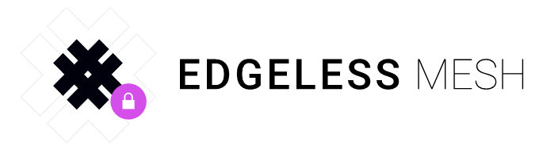

# Edgeless Mesh




[](https://github.com/edgelesssys/coordinator/actions)

[Edgeless Mesh](https://www.edgeless.systems/) is a framework for creating distributed confidential computing apps. Build your confidential microservices with [Edgeless RT](https://github.com/edgelesssys/edgelessrt), distribute them with Kubernetes on an SGX-enabled cluster, and let Edgeless Mesh take care of the rest. Deploy end-to-end secure and verifiable AI pipelines or crunch on sensitive big data in the cloud. Confidential computing at scale has never been easier. 

Edgeless Mesh guarantees that the topology of your distributed app adheres to a manifest specified in simple JSON. Edgeless Mesh verifies the integrity of services, bootstraps them, and sets up encrypted connections between them.

If a node fails, Edgeless Mesh will seamlessly substitute it with respect to the rules defined in the manifest.  

To keep things simple, Edgeless Mesh acts as certificate authority and issues one concise remote attestation statement for your whole distributed app. This can be used by anyone to verify the integrity of your distributed app. 

Edgeless Mesh is the service mesh for the age of confidential computing.

## Key features

* Authentication and integrity verification of microservices
* Provisioning of certificates, configurations, and application artifacts
* Remote attestation for the confidentiallity and integrity over the whole cluster.

## Overview


## Quickstart and documentation

You can deploy your confidential computing application with Mesh with ease. See the [Getting Started Guide](TODO) for how.

For more comprehensive documentation, start with the [docs](TODO)

## Build

To build the Coordinator control plane:

```bash
mkdir build
cd build
cmake ..
make
```

To build the data plane libraries and test applications:

```bash
cd marble
mkdir build
cd build
cmake ..
make
```

## Run

```bash
OE_SIMULATION=1 ./coordinator
```

## Test

### Unit Tests

```bash
go test -race ./...
```

### With SGX-DCAP attestation on enabled hardware (e.g., in Azure)

```bash
go test ./test/ -v -tags integration --args -c ../build/ -m ../marble/build/
```

### With SGX simulation mode

```bash
go test ./test/ -v -tags integration --args -c ../build/ -m ../marble/build/ -s
```

### Without SGX

```bash
go test ./test/ -v -tags integration --args -c ../build/ -m ../marble/build/ -s -noenclave
```

## Examples

### Hello World

We have two basic examples on how to build confidential applications with EdgelessMesh.

* See [helloworld](../samples/helloworld/README.md) for how integrate EdgelessMesh with your Golang application.
* See [helloc++](../samples/helloc++/README.md) for how integrate EdgelessMesh with your C++ application.

### Confidential Emoji Voting

The popular [Linkerd](https://linkerd.io) service mesh uses the simple and fun scalable *emojivoto* app as the default demo. You can find our confidential variant [here](https://github.com/edgelesssys/emojivoto). Your emoji votes have never been safer!
## Roadmap

Planned features include:

* Support for [Graphene](https://github.com/oscarlab/graphene), [SGX-LKL](https://github.com/lsds/sgx-lkl), and potentially other SGX software frameworks
* Distribution of the Control Plane to mitigate against a single point of failure

