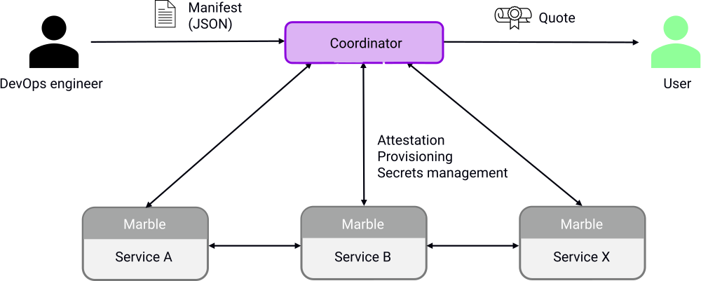

# Marblerun

[![GitHub Actions Status][github-actions-badge]][github-actions]
[![GitHub license][license-badge]](LICENSE)
[![Go Report Card][go-report-card-badge]][go-report-card]
[![PkgGoDev][go-pkg-badge]][go-pkg]
[![Gitter Chat][gitter-badge]][gitter]

[Marblerun][marblerunsh] is a framework for creating distributed confidential-computing apps.

Build your confidential microservices with [Edgeless RT][edgelessrt], distribute them with Kubernetes on an SGX-enabled cluster, and let Marblerun take care of the rest. Deploy end-to-end secure and verifiable AI pipelines or crunch on sensitive big data in the cloud. 

Confidential computing at scale has never been easier. Marblerun guarantees that the topology of your distributed app adheres to a Manifest specified in simple JSON. Marblerun verifies the integrity of services, bootstraps them, and sets up encrypted connections between them. If a node fails, Marblerun will seamlessly substitute it with respect to the rules defined in the Manifest.

To keep things simple, Marblerun issues one concise remote attestation statement for your whole distributed app. This can be used by anyone to verify the integrity of your distributed app.

### Key features

* Authentication and integrity verification of microservices with respect to a Manifest written in simple JSON :lock:
* Secrets management for microservices :key:
* Provisioning of certificates, configurations, and parameters for microservices :package:
* Remote attestation of the entire cluster :globe_with_meridians:

### Overview

## Quickstart and documentation

See the [Getting Started Guide][getting-started] to set up a distributed confidential-computing app in a few simple steps.
See the [documentation][docs] for details.

## Working in this repo

[`BUILD.md`](BUILD.md) includes general information on how to work in this repo.

## Get involved

* Follow [@EdgelessSystems][twitter] on Twitter.
* Chat with us on [Gitter][gitter].

## Examples

### Hello World

We provide two basic examples on how to build confidential apps with Marblerun.

* See [helloworld](samples/helloworld) for an example in Go.
* See [helloc++](samples/helloc++) for an example in C++.

### Confidential Emoji Voting

The popular [Linkerd][linkerd] service mesh uses the simple and scalable *emojivoto* app as its default demo. You can find our confidential variant [here][emojivoto]. Your emoji votes have never been more secure! 😉

## Roadmap :rocket:

Planned features include:

* Support for [Graphene][graphene], [SGX-LKL][sgx-lkl], and potentially other SGX software frameworks
* Distribution of the Control Plane to mitigate against a single point of failure

<!-- refs -->
[docs]: https://marblerun.sh/docs/introduction/
[edgelessrt]: https://github.com/edgelesssys/edgelessrt
[emojivoto]: https://github.com/edgelesssys/emojivoto
[getting-started]: https://marblerun.sh/docs/getting-started/quickstart/
[github-actions]: https://github.com/edgelesssys/marblerun/actions
[github-actions-badge]: https://github.com/edgelesssys/marblerun/workflows/Unit%20Tests/badge.svg
[go-pkg]: https://pkg.go.dev/github.com/edgelesssys/marblerun
[go-pkg-badge]: https://pkg.go.dev/badge/github.com/edgelesssys/marblerun
[go-report-card]: https://goreportcard.com/report/github.com/edgelesssys/marblerun
[go-report-card-badge]: https://goreportcard.com/badge/github.com/edgelesssys/marblerun
[graphene]: https://github.com/oscarlab/graphene
[license-badge]: https://img.shields.io/github/license/edgelesssys/marblerun
[linkerd]: https://linkerd.io
[marblerunsh]: https://marblerun.sh
[sgx-lkl]: https://github.com/lsds/sgx-lkl
[slack]: https://join.slack.com/t/confidentialcloud/shared_invite/zt-ix8nzzr6-vVNb6IM76Ab8z9a_5NMJnQ
[twitter]: https://twitter.com/EdgelessSystems
[gitter]: https://gitter.im/edgeless-systems/community
[gitter-badge]: https://badges.gitter.im/edgeless-systems/Marblerun.svg