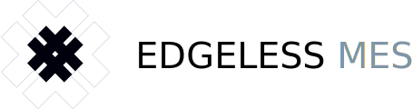

# Introduction

Edgeless Mesh is a framework for creating distributed confidential-computing apps.

Build your confidential microservices with [Edgeless RT][edgelessrt], distribute them with Kubernetes on an SGX-enabled cluster, and let Mesh take care of the rest. Deploy end-to-end secure and verifiable AI pipelines or crunch on sensitive big data in the cloud. Confidential computing at scale has never been easier.

Mesh guarantees that the topology of your distributed app adheres to a manifest specified in simple JSON. Mesh verifies the integrity of services, bootstraps them, and sets up encrypted connections between them. If a node fails, Mesh will seamlessly substitute it with respect to the rules defined in the manifest.  

To keep things simple, Mesh issues one concise remote attestation statement for your whole distributed app. This can be used by anyone to verify the integrity of your distributed app.

## Key features

* Authentication and integrity verification of microservices :lock:
* Provisioning of certificates, configurations, and application artifacts :package: 
* Remote attestation for the confidentiallity and integrity over the whole cluster :globe_with_meridians:

## Overview

The following gives a high-level overview of a Mesh-controlled cluster.

