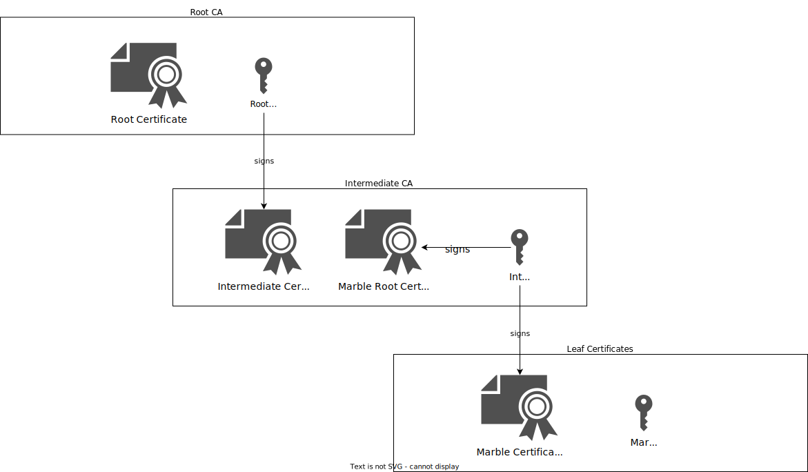
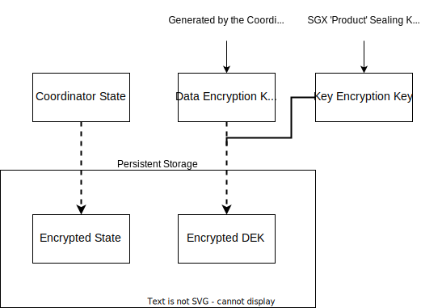
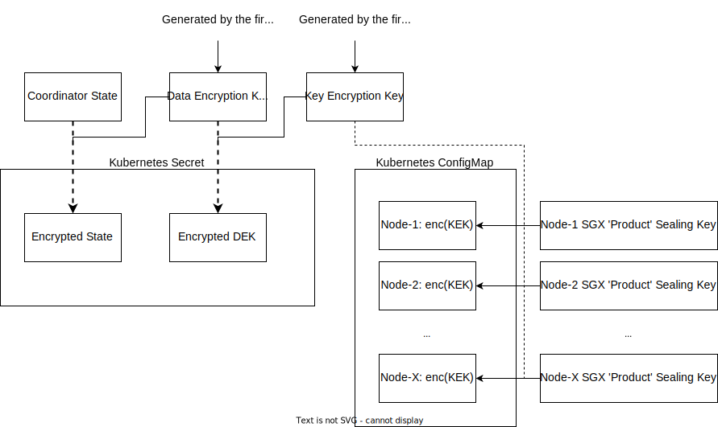

# Key management and cryptographic primitives

MarbleRun protects and isolates your deployments and workloads. To that end, cryptography is the foundation that ensures the confidentiality and integrity of all components.
Evaluating the security and compliance of MarbleRun requires a precise understanding of the cryptographic primitives and keys used.
The following gives an overview of the architecture and explains the technical details.

## High-level architecture

The [Coordinator](coordinator.md) and the [Marbles](marbles.md) run inside SGX Enclaves. See [Intel's documentation](https://www.intel.com/content/www/us/en/developer/tools/software-guard-extensions/overview.html) on the architecture details and cryptographic primitives of SGX.

MarbleRun uses cryptography for the following tasks.

* Authentication and authorization
* Establishing a public key infrastructure (PKI) for MarbleRun
* Encrypting network traffic via mutual TLS between enclaves
* Encrypting persistent state

The following graphic gives an overview of the architecture and the components.

## Authentication and authorization

MarbleRun uses the SGX [remote attestation](../features/attestation.md) capability to authenticate the Coordinator and the Marble enclaves.
For authorization, the [manifest](../features/manifest.md) defines the Marble's access to secrets and keys after successful attestation.
Furthermore, MarbleRun's [RBAC](../workflows/define-manifest.md#roles) attaches [users'](../workflows/define-manifest.md#users) identities to roles in the manifest.
Each role is associated with a set of operations the user can perform in the deployment.
Users are authenticated by the Coordinator using an RSA or ECDSA public key defined in the manifest.

## Public key infrastructure and certificate authority

The Coordinator establishes a public key infrastructure (PKI) for MarbleRun and acts as the certificate authority (CA).
The goal of the PKI is to make authentication of confidential applications based on remote attestation accessible and usable.
The Coordinator provides an [API](../reference/coordinator.md) for retrieving an SGX attestation statement that embeds its *Root CA Certificate* in the user-defined body.
By verifying the statement, clients can verify the certificate's authenticity and, thereby, the MarbleRun CA.
See the [attested TLS](#attested-tls-atls) section for details behind that concept.
All MarbleRun clients and Marbles can then use the attested *Root CA Certificate* for authenticating TLS connections.
This is further illustrated conceptually in the [attestation](../features/attestation.md) section. The following focuses on the cryptographic primitives.
The Coordinator generates a root X.509 certificate and corresponding asymmetric key pair during initialization.
The [Elliptic Curve Digital Signature Algorithm (ECDSA)](https://www.secg.org/sec1-v2.pdf#page=49) is used with curve [P256](https://nvlpubs.nist.gov/nistpubs/FIPS/NIST.FIPS.186-4.pdf#page=111).
The *Root CA Certificate* has no expiry date and lives as long as the MarbleRun deployment.

Alongside the *Root CA Certificate*, the Coordinator generates an X.509 *Intermediate Certificate* and corresponding asymmetric key pair, again using ECDSA with P256.
The *Intermediate Certificate* is signed by the Coordinator's *Root CA Certificate* and rotated with every manifest update.
When you push an update to the manifest (for example, bump up the *SecurityVersion* of a Mable), the *Intermediate Certificate* will change.
Instances with the new version won't authenticate with instances of the old version and vice versa.
Hence, no data flow is happening between different *SecurityVersions* of your application.
However, the *Root CA Certificate* doesn't change. So you can still verify the Coordinator and your application from the outside and ensure it's the same instance you might have interacted with.
Applications interacting with the MarbleRun deployment should use the intermediate certificate as CA to make manifest updates observable:
if the manifest changes, connections to the deployment will fail.
The application owner can then review the changes and install the new intermediate certificate to approve them.
If such observability isn't required, the application can use the root certificate as CA.
In that case, the application will continue to work even if the manifest changes.

The Coordinator creates a second certificate with the same key material as the *Intermediate Certificate* called the *Marble Root Certificate*.
In that sense, they're siblings containing the same public key.
However, while the *Intermediate Certificate* is signed by the *Root Certificate*, the *Marble Root Certificate* is self-signed using its private key.
The goal here is to implement a  [cross-signed certificate chain](https://www.ssltrust.com.au/blog/understanding-certificate-cross-signing).
In that way, the Marbles see the *Marble Root Certificate* as a self-signed root certificate. Hence, they're dealing with a terminating certificate chain without knowing about the Coordinator's *Root CA Certificate*.
The "outside world" sees an intermediate certificate signed by the Coordinator's *Root CA Certificate*.
The Coordinator generates a unique leaf *Marble Certificate* and corresponding key pair using ECDSA with P256 for every Marble.
The *Marble Root Certificate* signs the *Marble Certificate*.
The *Marble Certificate* is provisioned to the Marble's enclave via the secure channel established during the [attestation procedure](../features/attestation.md).
Depending on the Marble's runtime, the certificate can be used [manually](../workflows/add-service.md#make-your-service-use-the-provided-tls-credentials) or [automatically](../features/transparent-TLS.md) to establish mutually authenticated TLS connections.

## Attested TLS (aTLS)

In a confidential computing (CC) environment, attested TLS (aTLS) can establish secure connections between two parties using the remote attestation features of the CC components.
With aTLS, the party to be authenticated binds its TLS certificate to an attestation statement.
For example, it embeds the certificate's public key into the attestation statement.
Instead of relying on a certificate authority, aTLS uses this attestation statement to establish trust in the certificate.
The protocol can be used by clients to verify a server certificate, by a server to verify a client certificate, or for mutual verification (mutual aTLS).

## Encryption of state

The Coordinator holds MarbleRun's state, which consists of the [manifest](../features/manifest.md), the [managed secrets](../features/secrets-management.md), and the [certificates for its CA](../features/attestation.md).
The state is stored encrypted in persistent storage. For this, MarbleRun uses [AES128-GCM](https://www.rfc-editor.org/rfc/rfc5116#section-5.1) and a generated 16-byte data encryption key (DEK).
The DEK is also sealed to persistent storage to recover the state in case of a restart autonomously.
[SGX sealing](https://www.intel.com/content/www/us/en/developer/articles/technical/introduction-to-intel-sgx-sealing.html) is used for that purpose.
The Coordinator encrypts the DEK with a key encryption key (KEK).
MarbleRun uses the SGX sealing key called `Product key` as its KEK, which is bound to its `Product ID` and the enclave's author `MRSIGNER` identity.
In other words, a fresh and benign enclave instance of the same identity can recover that key.
Hence, if the Coordinator is restarted on the same CPU, it can obtain the same KEK from the CPU, decrypt the DEK, and recover its state.

If the Coordinator is restarted on a different CPU, it won't be able to obtain the same SGX sealing key from the CPU.
Therefore, MarbleRun provides a [recovery feature](../features/recovery.md#recovery).
The manifest allows for specifying a designated Recovery Key. The Recovery Key is a public RSA key. Upon startup, the Coordinator encrypts the DEK with this public key and returns it to the user.
In case of a recovery event, the user decrypts the DEK locally and [uploads it to the Coordinator](../workflows/recover-coordinator.md).
The Coordinator will decrypt the state with the DEK and proceed with operations.

For [multi-party use cases](../features/recovery.md#multi-party-recovery), MarbleRun allows splitting the Recovery Key between parties.
Every recovery party is defined in the manifest with its own public RSA key.
The Coordinator generates a share of the recovery secret for every party and encrypts it with the corresponding RSA key.
During a recovery event, every party will upload their share of the secret, which are all XORed together by the Coordinator to receive the combined key for decrypting the DEK.

### Distributed Coordinator

The [distributed Coordinator](../features/recovery.md#distributed-coordinator) works similarly. However, all Coordinators share the same state stored encrypted in the Kubernetes [Secret](https://kubernetes.io/docs/concepts/configuration/secret/) called *marble-state*.
In contrast to the single instance, the KEK is generated at start-up by the first instance.
The existing Coordinators authenticate every new Coordinator instance via remote attestation, and the KEK is subsequently shared via the secure and attested TLS connection.
Every Coordinator instance uses its own SGX Product (Sealing) Key to seal the KEK into a Kubernetes [ConfigMap](https://kubernetes.io/docs/concepts/configuration/configmap/) structure called "KEK."

