# Key management and cryptographic primitives

MarbleRun protects and isolates your deployments and workloads. To that end, cryptography is the foundation that ensures the confidentiality and integrity of all components.
Evaluating the security and compliance of MarbleRun requires a precise understanding of the cryptographic primitives and keys used.
The following gives an overview of the architecture and explains the technical details.

## High-level architecture

The [Coordinator](coordinator.md) and the [Marbles](marbles.md) run inside SGX Enclaves. See [Intel's documentation](https://www.intel.com/content/www/us/en/developer/tools/software-guard-extensions/overview.html) on the architecture details and cryptographic primitives of SGX.

MarbleRun uses cryptography for the following tasks.

* Authentication and authorization
* Establishing a Public Key Infrastructure (PKI) for MarbleRun
* Encrypting network traffic via mutual TLS between enclaves
* Encrypting persistent state

The following graphic gives an overview of the architecture and the components.

## Authentication and authorization

MarbleRun uses the SGX remote attestation capability to authenticate the Coordinator and the Marble enclaves. See our section on [attestation](../features/attestation.md) for more information on this process.
For authorization, the [manifest](../features/manifest.md) defines the Marble's access to secrets and keys after successful attestation.
Furthermore, MarbleRun's' [RBAC](../workflows/define-manifest.md#roles) attaches a Marble's identity to a role in the manifest.
Each role is associated with a set of operations that Marble can perform in the deployment.
Roles can also be attached to [users](../workflows/define-manifest.md#users), which are authenticated by the Coordinator using an RSA or ECDSA public key defined in the manifest.

## Public Key Infrastructure and Certificate Authority

The Coordinator establishes a public key infrastructure (PKI) for MarbleRun and acts as the Certificate Authority (CA).
The goal of the PKI is to make authentication of confidential applications based on remote attestation accessible and usable.
The Coordinator embeds its attestation statement into its root CA certificate, see the [attested TLS](#attested-tls-atls) section for details behind that concept.
All MarbleRun clients and Marbles can then use the attested root CA certificate for authenticating TLS connections.
This is further illustrated conceptionally in the [attestation](../features/attestation.md) section. We now focus on the cryptography.

During initialization the Coordinator generates a root x509 certificate and corrisponding asymmetric key pair.
The [Elliptic Curve Digital Signature Algorithm (ECDSA)](https://www.secg.org/sec1-v2.pdf#page=49) is used with curve [P256](https://nvlpubs.nist.gov/nistpubs/FIPS/NIST.FIPS.186-4.pdf#page=111).
The root certificate has no expiary date set and lives as long as the MarbleRun deployment.

Alongside the root certificate, the Coordinator generates an intermediate x509 certificate and corresponding asymmetric key pair, again using ECDSA with P256.
The intermediate certificate is signed by the Coordinator's root certificate and rotated with every update of the manifest.
When you push an update to the manifest (for example bump up the *SecurityVersion* of a Mable) the intermediate certificate will change.
Instances with the new version will not authenticate with instances of the old version and vice versa.
Hence, no data flow is happening between different *SecurityVersions* of your application.
However, the root certificate doesn't change. So you can still verify the Coordinator and your application from the outside and make sure it is the same instance you might have interacted with before.

The Coordinator creates a second intermediate certificate that is called the *Marble root certificate*.
The Marble root certificate is self-signed using the intermediate certificate's private key implementing a  [cross-signed certificate chain](https://www.ssltrust.com.au/blog/understanding-certificate-cross-signing).
In that way, the Marbles see a self-signed root certificate, hence, the are dealing with a terminating certificate chain without knowing about the Coordinator's root certificate.
The "outside world" sees an intermediate certificate signed by the Coordinator's root certificate and the corresponding root certificate.
Applications interacting with the MarbleRun deployment can decide wether to use the intermediate or the root certificate as CA depending on if they want to notice and handle manifest updates explicitely or not.

For every Marble the Coordinator generates a unique leaf "Marble" certificate and corresponding key pair using ECDSA with P256.
The Marble certificate is signed by the Marble root certificate.
The Marble certificate is provisioned to the Marble's enclave via the secure channel established during the [attestation procedure](../features/attestation.md).

## Attested TLS (aTLS)

In a CC environment, attested TLS (aTLS) can be used to establish secure connections between two parties using the remote attestation features of the CC components.
aTLS modifies the TLS handshake by embedding an attestation statement into the TLS certificate. Instead of relying on a certificate authority, aTLS uses this attestation statement to establish trust in the certificate.
The protocol can be used by clients to verify a server certificate, by a server to verify a client certificate, or for mutual verification (mutual aTLS).

### Mutual TLS authentication

Based on MarbleRun's PKI Marbles are provided with a unique leaf certificate and corresponding private key.
As described above these are generated by the Coordinator and provided during the Marble's initialization via the secure aTLS channel.
Depending on the Marble's runtime the certificate can either be used [manually](../workflows/add-service.md#make-your-service-use-the-provided-tls-credentials) or [automatically](../features/transparent-TLS.md) for establishing mutually authenticated TLS connetions.

## Encryption of state

The Coordinator holds the MarbleRuns state, which consists of the [manifest](../features/manifest.md), the [managed secrets](../features/secrets-management.md), and the [certificates for its CA](../features/attestation.md).
The state is stored encrypted in persistent storage. Therefore Constellation uses [AES128-GCM](https://www.rfc-editor.org/rfc/rfc5116#section-5.1) and a randomly generated 16-byte Data Encryption Key (KEK) to seal the state to persistent storage.
The DEK is also sealed to persistent storage to recover the state in case of a restart autonomously.
[SGX's sealing feature](https://www.intel.com/content/www/us/en/developer/articles/technical/introduction-to-intel-sgx-sealing.html) is used for that purpose.
The Coordinator encrypts the DEK with a key encryption key (KEK).
The KEK MarbleRun uses the SGX sealing key called `Product key`, which is bound to its `Product ID` and the enclave's author `MRSIGNER` identity.
In other words, a fresh and benign enclave instance of the same identity can recover that key.
Hence, as long as the Coordinator is restarted on the same CPU, it can obtain the same KEK from the CPU based on its identity, decrypt the DEK and recover its state.

### Distributed Coordinator

The [distributed Coordinator](../features/recovery.md#distributed-coordinator) works similarly. However, all Coordinators share the same state stored encrypted in the Kubernetes [Secret](https://kubernetes.io/docs/concepts/configuration/secret/) called *marble-state*.
In contrast to the single instance, the KEK is randomly generated at start-up by the first instance.
The existing Coordinators authenticate every new Coordinator instance via remote attestation, and the KEK is subsequently shared via the secure and attested TLS connection.
Every Coordinator instance uses its own SGX Product (Sealing) Key to seal the KEK into a Kubernetes [ConfigMap](https://kubernetes.io/docs/concepts/configuration/configmap/) structure called "KEK."

