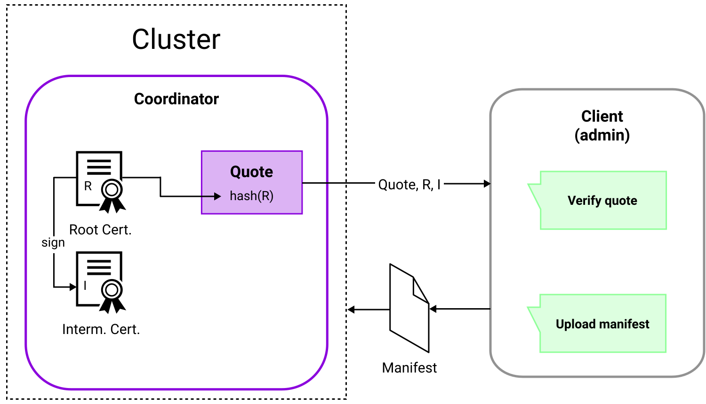
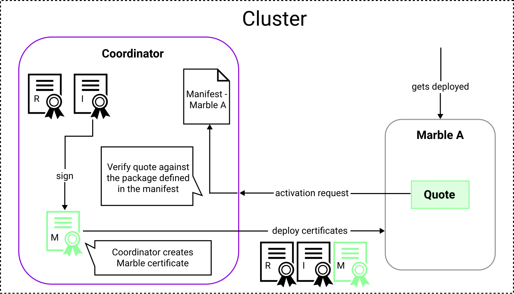
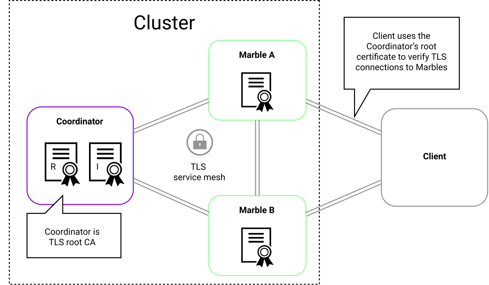
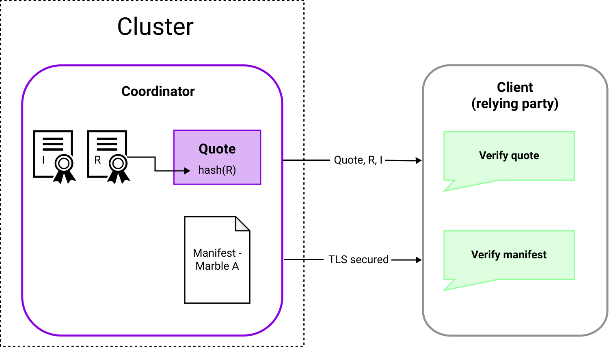

# Attestation

Hardware-rooted *remote attestation* is a key ingredient for distributed confidential apps. MarbleRun relies on the [*Data Center Attestation Primitives* (DCAP)](https://download.01.org/intel-sgx/sgx-dcap/1.11/linux/docs/DCAP_ECDSA_Orientation.pdf) of the latest SGX-enabled Intel Xeon processors.
At the time of writing, only Microsoft Azure had a public DCAP service deployed in their data centers. Hence, our demos are mainly tested and deployed on Azure Kubernetes Service (AKS).
However, MarbleRun works with any DCAP service complying with the SGX specification. You can read more about setting up your own DCAP infrastructure [in the Intel SGX development articles](https://www.intel.com/content/www/us/en/developer/articles/guide/intel-software-guard-extensions-data-center-attestation-primitives-quick-install-guide.html).

## Coordinator deployment

Initially, the MarbleRun Coordinator is deployed to the cluster.
The Coordinator generates an X.509 certificate chain with a root and intermediate certificate authority (CA).
It generates a remote attestation quote that contains the hash of the root certificate (as `report_data`) as well as a hardware measurement of its enclave (`MRENCLAVE` of the report).

The admin receives the quote and verifies the Coordinator's integrity via the measurement. Next, they verify that the quote contains the root certificate’s hash. This ensures that the certificate was indeed generated by this Coordinator and wasn't manipulated during transport.

After the successful verification of the Coordinator, the manifest can be uploaded to the cluster.
The [manifest](../workflows/define-manifest.md) describes which Marbles (services) are allowed to join the confidential mesh. The manifest contains their enclaves’ build-time measurements.

## Marble deployment and attestation

The Coordinator enforces the manifest and only admits the desired Marbles to the cluster.
Each Marble registers itself with a quote via gRPC to the Coordinator. This quote is tied to the TLS session of the gRPC call. It contains the Marble's measurements. The Coordinator compares them to the manifest to ensure the Marble's identity and integrity.

More specifically, the Marble will generate an [ECDSA](https://www.secg.org/sec1-v2.pdf#page=49) private key using curve [P256](https://nvlpubs.nist.gov/nistpubs/FIPS/NIST.FIPS.186-4.pdf#page=111), and a self signed TLS certificate.
It then hashes the certificate using SHA-256 and creates an SGX quote over the hash.
The Marble uses this certificate to establish a TLS connection with the Coordinator and send the quote.
The Coordinator verifies the Marble's measurements contained in the quote against the manifest, and makes sure the Marble's TLS certificate matches the quote.
If all checks pass, the Marble is admitted into the cluster.

The Coordinator now generates new [Marble TLS credentials](../features/secrets-management.md#certificates) and signs them with the intermediate certificate.
The Coordinator's certificate chain and the freshly generated Marble certificate are then delivered to the Marble.

## Confidential service mesh

The Marble and the Coordinator can now communicate securely and authenticated over TLS (with client authentication), using the Coordinator's CA as the root of trust.
In the same way, Marbles can communicate via mutual TLS with other Marbles, because the X.509 certificates of both Marbles were signed by the same intermediate certificate.

If a client wants to connect to a Marble, the Coordinator acts as a trusted CA to establish a TLS connection and verify the Marble's certificate.

When the Coordinator receives an update to the manifest, e.g., a Marble is updated to a newer security version, a new intermediate certificate is generated. The communication between Marbles relies on the intermediate certificate as the root of trust. This ensures that Marbles which were deployed before the update can't communicate with Marbles that have the newer security version.

## Cluster attestation

The Coordinator issues one concise remote attestation statement for your whole distributed app.
The Coordinator's build-time measurement is distributed to the relying party (this must be done by the admin or operator).
The relying party requests the Coordinator's quote and certificate chain.
The quote contains the hash of the Coordinator's root CA certificate, which is verified against the received certificate chain.
The quote also contains the Coordinator's measurement, which is verified against the build-time measurement.

The relying party then requests the manifest from the Coordinator and ensures it contains the expected Marbles and their expected measurements.
The steps required on the client side are described in the [verification hands-on](../workflows/verification.md).

