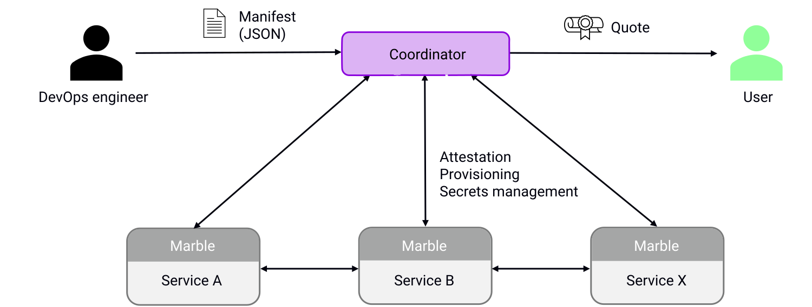

# Welcome to MarbleRun

MarbleRun is a framework for deploying distributed confidential computing applications.
MarbleRun acts as a confidential operator for your deployment. Think of a trusted party in the control plane.

Build your confidential microservices with tools like [EGo, Gramine, or similar runtime](./features/runtimes.md), orchestrate them with Kubernetes on an SGX-enabled cluster, and let MarbleRun take care of the rest.
Deploy end-to-end secure and verifiable AI pipelines or crunch on sensitive big data in the cloud. Confidential computing at scale has never been easier.

MarbleRun simplifies the process by handling much of the groundwork.
It ensures that your app's topology adheres to your specified manifest.
It verifies the identity and integrity of all your services, bootstraps them, and establishes secure, encrypted communication channels.
As your app needs to scale, MarbleRun manages the addition of new instances, ensuring their secure verification.

MarbleRun provides comprehensive access and privilege management through its role-based access control (RBAC) feature. This can be used to enforce security policies such as 4-eye principles and other verification procedures in your operations.

For added simplicity, MarbleRun offers a single remote attestation statement for your entire app. Anyone can use this to verify the integrity of your distributed app, making it easier to assure stakeholders of your app's security.

## Key features

🔒 Authentication and integrity verification of microservices based on the manifest

🔑 Secrets management for confidential microservices

📃 Provisioning of certificates, configurations, and parameters

🔬 Remote attestation of the entire deployment

👥 Role-based access control (RBAC), verifiable updates, and multi-stakeholder support

## Overview

Logically, MarbleRun consists of two parts, the control plane called *Coordinator* and the data plane called *Marbles*.
The Coordinator needs to be deployed once in your cluster, and the Marble layer needs to be integrated with each service.
MarbleRun is configured with a simple JSON document called the *manifest*.
It specifies the distributed app's topology and infrastructure properties and provides configuration parameters for each service.

