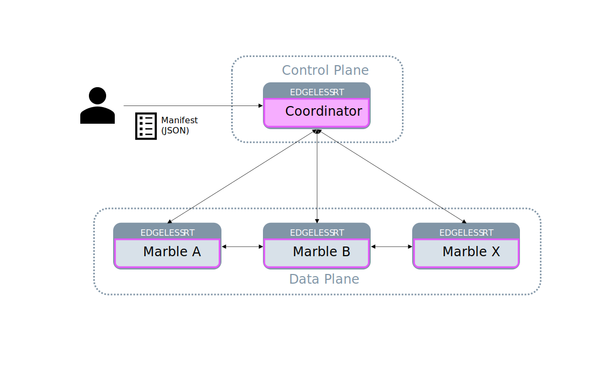

# Overview

Logically, Marblerun consists of two parts, the control plane called *Coordinator* and the data plane called *Marbles*.
The Coordinator needs to be deployed once in your cluster and the Marble layer needs to be integrated with each service.
Marblerun is configured with a simple JSON document called the *Manifest*.
It specifies the topology of the distributed app, the infrastructure properties, and provides configuration parameters for each service.



## Manifest

The Manifest is a simple JSON file specifying three asset groups: *Packages*, *Infrastructures*, and *Marbles*:

### Manifest:Packages

A package defines a specific container image in your application.
It contains the secure enclave's measurements and associated properties:

* **UniqueID**: The enclave's unique identifying measurement, called MRENCLAVE on SGX
* **SignerID**: The signer's unique identifier, called MRSIGNER on SGX
* **ProductID**: The unique identifier of your product associated with the enclave
* **SecurityVersion**: The version number of your product associated with the enclave
* **Debug**: A flag indicating whether your enclave should be run in debug mode

You can use any combination of these values depending on how you want to identify the image.
For each confidential container you want to run in your cluster, you need to add an entry in the *Packages* section of the Manifest.

```json
    "Packages": {
        "backend": {
            "UniqueID": "000102030405060708090a0b0c0d0e0f101112131415161718191a1b1c1d1e1f",
            "ProductID": 42,
            "SecurityVersion": 1,
            "Debug": false
        },
        "frontend": {
            "SignerID": "c0ffeec0ffeec0ffeec0ffeec0ffeec0ffeec0ffeec0ffeec0ffeec0ffeec0ffee",
            "ProductID": 43,
            "SecurityVersion": 3,
            "Debug": true
        }
    }
```

### Manifest:Marbles

Marbles represent the actual services in your mesh. They are defined in the *Marbles* section. Each Marble corresponds to a *Package* and defines a set of optional *Parameters*:

* Files: Files and their contents
* Env: Environment variables
* Argv: Command line arguments

These *Parameters* are passed from the Coordinator to secure enclaves after successful initial remote attestation. *Parameters* can contain the following placeholders:

* `$$root_ca`: The root certificate of the cluster issued by the Coordinator; it can be used to verify the certificates of all Marbles in the cluster.
* `$$marble_cert`: The Marble's certificate; issued by the Coordinator and used for Marble-to-Marble and Marble-to-client authentication
* `$$marble_key`: The private key corresponding to `$$marble_cert`
* `$$seal_key`: A 128-bit symmetric encryption key that can be used for sealing data to disk in a host-independent way; if a Marble is scheduled or restarted on a new host, this "virtual sealing key" will still allow for unsealing data from the disk even though the host's actual sealing key might have changed.

```json
    "Marbles": {
        "backend_first": {
            "Package": "backend",
            "MaxActivations": 1,
            "Parameters": {
                "Files": {
                    "/tmp/defg.txt": "foo",
                    "/tmp/jkl.mno": "bar"
                },
                "Env": {
                    "IS_FIRST": "true",
                    "ROOT_CA": "$$root_ca",
                    "SEAL_KEY": "$$seal_key",
                    "MARBLE_CERT": "$$marble_cert",
                    "MARBLE_KEY": "$$marble_key"
                },
                "Argv": [
                    "--first",
                    "serve"
                ]
            }
        },
        "frontend": {
            "Package": "frontend",
            "Parameters": {
                "Env": {
                    "ROOT_CA": "$$root_ca",
                    "SEAL_KEY": "$$seal_key",
                    "MARBLE_CERT": "$$marble_cert",
                    "MARBLE_KEY": "$$marble_key"
                }
            }
        }
    }
```

### Manifest:Infrastructures

Future versions of Marblerun will allow you to define certain trusted infrastructures and hardware configurations under *Infrastructures*.

## Coordinator

The Coordinator represents the control plane in Marblerun.
It communicates with the data plane through gRPC and provides an HTTP-REST interface on the client-side.
The Coordinator can be configured with several environment variables:

* `EDG_COORDINATOR_MESH_ADDR`: The listener address for the gRPC server
* `EDG_COORDINATOR_CLIENT_ADDR`: The listener address for the HTTP server
* `EDG_COORDINATOR_DNS_NAMES`: The DNS names for the cluster's root certificate
* `EDG_COORDINATOR_SEAL_DIR`: The file path for storing sealed data

### Client API

The Client API is designed as an HTTP-REST interface.
The API currently contains two endpoints:

* `/manifest`: For deploying and verifying the Manifest
    * Example for setting the Manifest:

        ```bash
        curl --cacert marblerun.crt --data-binary @manifest.json "https://$MARBLERUN/manifest"
        ```

    * Example for verifying the deployed Manifest

        ```bash
        curl --cacert marblerun.crt "https://$MARBLERUN/manifest" | jq '.ManifestSignature' --raw-output
        ```

* `/quote`: For retrieving a remote attestation quote over the whole cluster and the root certificate
    * Example for retrieving a quote

        ```bash
        curl -k "https://$MARBLERUN/quote"
        ```

    * We provide a tool to automatically verify the quote and output the trusted certificate:

        ```bash
        go install github.com/edgelesssys/era/cmd/era
        era -c coordinator-era.json -h $MARBLERUN -o marblerun.crt
        ```

        * Note that `coordinator-era.json` contains the *Packages* information for the Coordinator. For our testing image this can be pulled from our GitHub releases:

        ```bash
        wget https://github.com/edgelesssys/marblerun/releases/latest/download/coordinator-era.json
        ```

## Marbles

Marbles represent the data plane in Marblerun and run your actual application code in secure enclaves within otherwise normal Docker containers. Marbles communicate with the Coordinator via gRPC over TLS. See the [Add a Service](add-service.md) section on how to build a Marble.

Marbles can be configured with several environment variables.

* `EDG_MARBLE_COORDINATOR_ADDR`: The Coordinator's address
* `EDG_MARBLE_TYPE`: The Marble's Package
* `EDG_MARBLE_DNS_NAMES`: The DNS names in the Marble's Certificate
* `EDG_MARBLE_UUID_FILE`: The file path for storing the Marble's UUID, needed for restart persistence.
